# EA-5: Backend Core Services Architecture Analysis

## Overview
This document provides a comprehensive analysis of the LexiFlow backend core services including Cases, Documents, Authentication, and Users modules.

## Core Services Architecture Diagram

```mermaid
graph TB
    subgraph "Client Layer"
        CLIENT[HTTP Client]
    end

    subgraph "Controller Layer"
        CC[CasesController<br/>5 REST endpoints]
        DC[DocumentsController<br/>8 REST endpoints]
        AC[AuthController<br/>10 REST endpoints]
        UC[UsersController<br/>5 REST endpoints]
    end

    subgraph "Guard Layer"
        JG[JwtAuthGuard<br/>Passport JWT Strategy]
        RG[RolesGuard<br/>Role-based Access]
        PG[PermissionsGuard<br/>Permission-based Access]
        PUB[Public Decorator<br/>Bypass Auth]
    end

    subgraph "Service Layer"
        CS[CasesService<br/>197 lines]
        DS[DocumentsService<br/>259 lines]
        AS[AuthService<br/>377 lines<br/>⚠️ In-memory tokens]
        US[UsersService<br/>184 lines<br/>⚠️ In-memory storage]
    end

    subgraph "External Services"
        FS[FileStorageService<br/>File operations]
        PJS[ProcessingJobsService<br/>OCR & Redaction jobs]
    end

    subgraph "Data Layer"
        CE[Case Entity<br/>TypeORM]
        DE[Document Entity<br/>TypeORM]
        UE[User Entity<br/>TypeORM<br/>⚠️ Not used by UsersService]

        CASEDB[(Cases Table)]
        DOCDB[(Documents Table)]
        USERDB[(Users Table<br/>⚠️ Not populated)]
    end

    subgraph "Related Entities"
        CLIENT_E[Client Entity]
        EVIDENCE[EvidenceItem Entity]
        CONFLICT[ConflictCheck Entity]
        PARTY[Party Entity]
    end

    CLIENT -->|HTTP Requests| CC
    CLIENT -->|HTTP Requests| DC
    CLIENT -->|HTTP Requests| AC
    CLIENT -->|HTTP Requests| UC

    CC -.->|Protected by| JG
    DC -.->|Protected by| JG
    UC -.->|Protected by| JG
    UC -.->|Protected by| RG
    UC -.->|Protected by| PG
    AC -.->|Public routes| PUB

    CC --> CS
    DC --> DS
    AC --> AS
    UC --> US

    AS --> US
    AS -.->|Stores in Map| AS
    US -.->|Stores in Map| US

    DS --> FS
    DC --> PJS

    CS --> CE
    DS --> DE

    CE --> CASEDB
    DE --> DOCDB
    UE -.->|Should use| USERDB

    CE -->|ManyToOne| CLIENT_E
    CE -->|OneToMany| EVIDENCE
    CE -->|OneToMany| CONFLICT
    CE -->|OneToMany| PARTY
    DE -->|ManyToOne| UE

    style AS fill:#ff9999
    style US fill:#ff9999
    style UE fill:#ff9999
    style USERDB fill:#ff9999
```



## Module Breakdown

### 1. Cases Module (`/backend/src/cases/`)

**API Endpoints:**
- `GET /api/v1/cases` - List all cases with filtering and pagination
- `GET /api/v1/cases/:id` - Get case by ID
- `POST /api/v1/cases` - Create new case
- `PUT /api/v1/cases/:id` - Update case
- `DELETE /api/v1/cases/:id` - Soft delete case
- `POST /api/v1/cases/:id/archive` - Archive case

**Service Methods:**
- `findAll(filterDto)` - Paginated list with filters (search, status, type, practiceArea, etc.)
- `findOne(id)` - Get single case
- `create(createCaseDto)` - Create with duplicate caseNumber check
- `update(id, updateCaseDto)` - Update with duplicate check
- `remove(id)` - Soft delete
- `archive(id)` - Set isArchived flag
- `toCaseResponse(entity)` - Private mapper method

**Data Flow:**
1. Request → CasesController → CasesService
2. Service validates and transforms DTOs
3. TypeORM QueryBuilder constructs SQL
4. Results mapped to CaseResponseDto
5. Response returned with pagination metadata

**Entity Relationships:**
- Case → Client (ManyToOne)
- Case → EvidenceItem (OneToMany)
- Case → ConflictCheck (OneToMany)
- Case → Party (OneToMany)

### 2. Documents Module (`/backend/src/documents/`)

**API Endpoints:**
- `GET /api/v1/documents` - List documents with filtering
- `GET /api/v1/documents/:id` - Get document metadata
- `POST /api/v1/documents` - Upload document with file
- `PUT /api/v1/documents/:id` - Update document metadata
- `DELETE /api/v1/documents/:id` - Delete document and file
- `GET /api/v1/documents/:id/download` - Download file
- `POST /api/v1/documents/:id/ocr` - Trigger OCR processing
- `POST /api/v1/documents/:id/redact` - Create redaction job

**Service Methods:**
- `create(dto, file, userId)` - Create with file storage
- `findAll(filterDto)` - Paginated list with filters
- `findOne(id)` - Get single document
- `update(id, dto, userId)` - Update metadata
- `remove(id)` - Delete document and file
- `downloadFile(id)` - Retrieve file buffer
- `markOcrProcessed(id, content)` - Update OCR status
- `findByCaseId(caseId)` - Get case documents
- `searchFullText(term)` - Full-text search

**Data Flow:**
1. Multipart request → DocumentsController
2. File interceptor extracts file
3. DocumentsService validates and stores file
4. FileStorageService handles file operations
5. Document metadata saved to database
6. Processing jobs triggered for OCR/redaction

**Dependencies:**
- FileStorageService - File operations
- ProcessingJobsService - Async processing

**Entity Relationships:**
- Document → User (ManyToOne via creatorId)

### 3. Authentication Module (`/backend/src/auth/`)

**API Endpoints:**
- `POST /api/v1/auth/register` - Register new user (Public)
- `POST /api/v1/auth/login` - Login with credentials (Public)
- `POST /api/v1/auth/refresh` - Refresh access token (Public)
- `POST /api/v1/auth/logout` - Logout and invalidate tokens (Protected)
- `GET /api/v1/auth/profile` - Get current user (Protected)
- `PUT /api/v1/auth/profile` - Update profile (Protected)
- `POST /api/v1/auth/change-password` - Change password (Protected)
- `POST /api/v1/auth/forgot-password` - Request reset (Public)
- `POST /api/v1/auth/reset-password` - Reset with token (Public)
- `POST /api/v1/auth/verify-mfa` - Verify MFA code (Public)

**Service Methods:**
- `register(dto)` - Create user and return tokens
- `login(dto)` - Validate credentials, return tokens or MFA challenge
- `refresh(token)` - Validate refresh token, issue new tokens
- `logout(userId)` - Remove refresh token from storage
- `changePassword(userId, current, new)` - Update password with validation
- `forgotPassword(email)` - Generate reset token
- `resetPassword(token, password)` - Reset password with token
- `verifyMfa(token, code)` - Verify TOTP code (⚠️ incomplete)
- `validateUser(email, password)` - Bcrypt password check
- `generateTokens(user)` - Create JWT access and refresh tokens
- `generateMfaToken(userId)` - Create short-lived MFA token
- `verifyTotpCode(user, code)` - TOTP verification (⚠️ returns false)

**Authentication Flow:**
```
Login Request
    ↓
validateUser(email, password)
    ↓
bcrypt.compare(password, hash)
    ↓
MFA enabled? → Yes → Return MFA token
    ↓ No
generateTokens(user)
    ↓
Store refresh token in Map
    ↓
Return access + refresh tokens
```

**Strategies:**
- **JwtStrategy** - Validates Bearer token from Authorization header
- **LocalStrategy** - Username/password validation
- **RefreshStrategy** - Validates refresh tokens

**Guards:**
- **JwtAuthGuard** - Enforces JWT authentication, respects @Public decorator
- **RolesGuard** - Checks user role against @Roles decorator
- **PermissionsGuard** - Checks permissions against @Permissions decorator

### 4. Users Module (`/backend/src/users/`)

**API Endpoints:**
- `GET /api/v1/users` - List all users (⚠️ no pagination)
- `GET /api/v1/users/:id` - Get user by ID
- `POST /api/v1/users` - Create user
- `PUT /api/v1/users/:id` - Update user
- `DELETE /api/v1/users/:id` - Delete user

**Service Methods:**
- `create(dto)` - Create user with hashed password
- `findAll()` - ⚠️ Returns ALL users, no pagination
- `findById(id)` - Get user by ID
- `findByEmail(email)` - Get user by email
- `update(id, dto)` - Update with duplicate email check
- `remove(id)` - Delete from Map
- `updatePassword(id, password)` - Hash and update password
- `setMfaEnabled(id, enabled)` - Toggle MFA
- `setActive(id, isActive)` - Toggle active status
- `findByRole(role)` - Filter by role
- `toAuthenticatedUser(user)` - Private mapper, adds permissions from ROLE_PERMISSIONS

**Data Flow:**
```
Request → UsersController (with guards)
    ↓
Check permissions (USER_MANAGE)
    ↓
UsersService → In-memory Map
    ↓
toAuthenticatedUser (strips password)
    ↓
Return user with permissions
```

## Cross-Module Dependencies


## Security Architecture

### Role-Based Access Control (RBAC)

**Roles Enum:**
- SUPER_ADMIN
- SENIOR_PARTNER
- PARTNER
- ASSOCIATE
- PARALEGAL
- LEGAL_SECRETARY
- ADMINISTRATOR
- CLIENT_USER
- GUEST

**Permissions Enum:**
- CASE_CREATE, CASE_READ, CASE_UPDATE, CASE_DELETE
- DOCUMENT_CREATE, DOCUMENT_READ, DOCUMENT_UPDATE, DOCUMENT_DELETE
- BILLING_CREATE, BILLING_READ, BILLING_UPDATE, BILLING_DELETE
- USER_MANAGE
- SYSTEM_ADMIN

**Permission Flow:**
1. JwtAuthGuard validates token and attaches user to request
2. RolesGuard checks user.role against @Roles decorator
3. PermissionsGuard checks user.permissions against @Permissions decorator
4. All must pass for request to proceed

## Duplicative Code Patterns Identified

### 1. Guard Duplication
**Location:**
- `/backend/src/auth/guards/jwt-auth.guard.ts` (25 lines)
- `/backend/src/common/guards/jwt-auth.guard.ts` (similar implementation)
- Same for: `roles.guard.ts`, `permissions.guard.ts`

**Impact:** Code maintenance overhead, potential for divergence

**Recommendation:** Consolidate to `/backend/src/common/guards/` and update all imports

### 2. Pagination Logic Duplication
**Locations:**
- `/backend/src/cases/cases.service.ts:95-109`
- `/backend/src/documents/documents.service.ts:133-148`
- `/backend/src/projects/projects.service.ts:66-70`
- Plus 12+ other service files

**Pattern:**
```typescript
const skip = (page - 1) * limit;
queryBuilder.skip(skip).take(limit);
const [data, total] = await queryBuilder.getManyAndCount();
return {
  data,
  total,
  page,
  limit,
  totalPages: Math.ceil(total / limit),
};
```

**Recommendation:** Create a shared pagination utility or use the existing `/backend/src/common/services/pagination.service.ts`

### 3. Dynamic OrderBy Pattern (⚠️ SQL Injection Risk)
**Locations (15+ instances):**
- `/backend/src/cases/cases.service.ts:95`
- `/backend/src/documents/documents.service.ts:133`
- `/backend/src/projects/projects.service.ts:66`
- `/backend/src/billing/time-entries/time-entries.service.ts:113`
- `/backend/src/billing/invoices/invoices.service.ts:108`
- `/backend/src/billing/expenses/expenses.service.ts:89`
- `/backend/src/discovery/custodians/custodians.service.ts:72`
- `/backend/src/discovery/depositions/depositions.service.ts:67`
- `/backend/src/discovery/examinations/examinations.service.ts:63`
- `/backend/src/discovery/productions/productions.service.ts:63`
- `/backend/src/discovery/privilege-log/privilege-log.service.ts:72`
- `/backend/src/discovery/legal-holds/legal-holds.service.ts:62`
- `/backend/src/discovery/esi-sources/esi-sources.service.ts:72`
- `/backend/src/discovery/custodian-interviews/custodian-interviews.service.ts:70`
- `/backend/src/discovery/discovery-requests/discovery-requests.service.ts:69`

**Vulnerable Pattern:**
```typescript
queryBuilder.orderBy(`tableName.${sortBy}`, sortOrder);
```

**Risk:** If `sortBy` comes from user input without validation, attackers can inject SQL

### 4. Filter DTO Duplication
**Pattern:** Each module has nearly identical filter DTOs with:
- `page?: number`
- `limit?: number`
- `sortBy?: string`
- `sortOrder?: 'ASC' | 'DESC'`

**Existing Solution Not Used:** `/backend/src/common/dto/pagination.dto.ts` already exists with proper @Max validation but is not extended

### 5. In-Memory Storage Pattern
**Locations:**
- `/backend/src/auth/auth.service.ts:19,21,24` - refreshTokens, resetTokens, mfaTokens
- `/backend/src/users/users.service.ts:17` - users Map
- `/backend/src/compliance/conflict-checks/conflict-checks.service.ts:15`
- `/backend/src/compliance/audit-logs/audit-logs.service.ts:13`
- Plus 10+ other services

**Pattern:**
```typescript
private resourceName: Map<string, Type> = new Map();
```

**Impact:** Data lost on restart, not horizontally scalable

## Open-Ended Data Segments & Vulnerabilities

### 🔴 Critical Security Issues

#### 1. SQL Injection via Dynamic OrderBy (15+ instances)
**Severity:** HIGH
**File:** `/backend/src/cases/cases.service.ts:95`
```typescript
queryBuilder.orderBy(`case.${sortBy}`, sortOrder);
```
**Issue:** `sortBy` parameter from user input is directly interpolated into SQL without validation. User could pass `sortBy=id; DROP TABLE cases--`

**Affected Files:**
- cases/cases.service.ts:95
- documents/documents.service.ts:133
- projects/projects.service.ts:66
- billing/time-entries/time-entries.service.ts:113
- billing/invoices/invoices.service.ts:108
- billing/expenses/expenses.service.ts:89
- All discovery module services (custodians, depositions, examinations, etc.)

**Recommendation:** Whitelist allowed sort fields
```typescript
const allowedSortFields = ['createdAt', 'updatedAt', 'title', 'status'];
if (sortBy && !allowedSortFields.includes(sortBy)) {
  sortBy = 'createdAt'; // default
}
```

#### 2. Unbounded Pagination Limits
**Severity:** MEDIUM
**Files:**
- `/backend/src/cases/dto/case-filter.dto.ts:49` - No @Max validation
- `/backend/src/documents/dto/document-filter.dto.ts:67` - No @Max validation
- Plus 20+ other filter DTOs

**Issue:** User can pass `limit=999999999` and retrieve entire database

**Contrast:** `/backend/src/common/dto/pagination.dto.ts:27` HAS @Max(100) but is not being used

**Recommendation:** Add @Max(100) to all limit parameters or extend common PaginationDto

#### 3. No Pagination on Users.findAll()
**Severity:** MEDIUM
**File:** `/backend/src/users/users.service.ts:71-75`
```typescript
async findAll(): Promise<AuthenticatedUser[]> {
  return Array.from(this.users.values()).map((user) =>
    this.toAuthenticatedUser(user),
  );
}
```
**Issue:** Returns ALL users without pagination. Could be thousands of records.

**Recommendation:** Add pagination parameters to findAll()

#### 4. Missing Validation on Redaction Parameters
**Severity:** MEDIUM
**File:** `/backend/src/documents/documents.controller.ts:156`
```typescript
async createRedaction(
  @Param('id', ParseUUIDPipe) id: string,
  @Body() redactionParams: any,  // ⚠️ typed as 'any'
)
```
**Issue:** No validation on redaction parameters. User could pass malicious data.

**Recommendation:** Create RedactionParamsDto with proper validation

#### 5. Incomplete MFA Implementation
**Severity:** HIGH
**File:** `/backend/src/auth/auth.service.ts:360-376`
```typescript
private async verifyTotpCode(
  user: AuthenticatedUser,
  code: string,
): Promise<boolean> {
  // TODO: Implement proper TOTP verification
  // For now, MFA verification requires proper implementation
  // Returning false ensures MFA cannot be bypassed
  return false;  // ⚠️ Always returns false!
}
```
**Issue:** MFA can never succeed. Either implement properly or remove MFA feature.

**Recommendation:** Implement using speakeasy library or disable MFA until implemented

### 🟡 Production Readiness Issues

#### 6. In-Memory Token Storage
**Severity:** HIGH
**File:** `/backend/src/auth/auth.service.ts:19-24`
```typescript
private refreshTokens: Map<string, string> = new Map();
private resetTokens: Map<string, { userId: string; expires: Date }> = new Map();
private mfaTokens: Map<string, { userId: string; expires: Date }> = new Map();
```
**Issue:**
- All tokens lost on server restart
- Not suitable for horizontal scaling
- No persistence or expiration cleanup

**Recommendation:** Use Redis or database for token storage

#### 7. In-Memory User Storage
**Severity:** HIGH
**File:** `/backend/src/users/users.service.ts:17`
```typescript
private users: Map<string, any> = new Map();
```
**Issue:**
- User entity exists but is not used
- Users table never populated
- All user data lost on restart

**Recommendation:** Use TypeORM repository with User entity

#### 8. No Rate Limiting on Authentication Endpoints
**Severity:** MEDIUM
**File:** `/backend/src/auth/auth.controller.ts:48-55`
```typescript
@Post('login')
async login(@Body() loginDto: LoginDto) {
  return this.authService.login(loginDto);
}
```
**Issue:** No rate limiting allows brute force attacks on login

**Recommendation:** Add rate limiting decorator or use @nestjs/throttler

#### 9. Insufficient Audit Logging
**Severity:** LOW
**Files:** Multiple in auth.service.ts (lines 76-78, 130, 163, etc.)
```typescript
console.log(`[AUTH] User ${user.email} logged in at ${new Date().toISOString()}`);
```
**Issue:** Security events only logged to console, not persisted

**Recommendation:** Integrate proper audit logging service

### 🟢 Performance Issues

#### 10. Inefficient Full-Text Search
**Severity:** LOW
**File:** `/backend/src/documents/documents.service.ts:251-258`
```typescript
async searchFullText(searchTerm: string): Promise<Document[]> {
  return await this.documentRepository.find({
    where: {
      fullTextContent: Like(`%${searchTerm}%`),  // ⚠️ Inefficient
    },
    order: { createdAt: 'DESC' },
  });
}
```
**Issue:** Using LIKE for full-text search is slow on large datasets. PostgreSQL has better full-text search capabilities.

**Recommendation:** Use PostgreSQL full-text search (`to_tsvector`, `to_tsquery`) or integrate Elasticsearch

#### 11. Missing Database Indexes
**Observation:** While entities define some @Index decorators, many frequently queried fields lack indexes:
- Case.leadAttorneyId (used in filtering)
- Case.assignedTeamId (used in filtering)
- Document.caseId has @Index ✓
- Document.creatorId has @Index ✓
- Document.fullTextContent (used in search) - should use GIN index for PostgreSQL

#### 12. No Query Result Caching
**Issue:** Same queries repeated without caching layer (e.g., frequent findOne calls)

**Recommendation:** Implement Redis caching for frequently accessed records

## Data Flow Summary

### Case Creation Flow
```
POST /api/v1/cases
    ↓
CasesController.create(dto)
    ↓
JwtAuthGuard validates token
    ↓
CasesService.create(dto)
    ↓
Check duplicate caseNumber
    ↓
caseRepository.create(dto)
    ↓
caseRepository.save(entity)
    ↓
toCaseResponse(savedCase)
    ↓
Return CaseResponseDto
```

### Document Upload Flow
```
POST /api/v1/documents (multipart)
    ↓
FileInterceptor extracts file
    ↓
DocumentsController.create(dto, file)
    ↓
JwtAuthGuard validates token
    ↓
DocumentsService.create(dto, file, userId)
    ↓
FileStorageService.storeFile(file, caseId, docId, version)
    ↓
documentRepository.save(metadata + filePath)
    ↓
Return Document entity
```

### Authentication Flow
```
POST /api/v1/auth/login
    ↓
AuthController.login(dto)
    ↓
AuthService.validateUser(email, password)
    ↓
bcrypt.compare(password, user.password)
    ↓
Check if MFA enabled
    ↓ Yes
generateMfaToken(userId)
Return { requiresMfa: true, mfaToken }
    ↓ No
generateTokens(user)
    ↓
Store refreshToken in Map
    ↓
Return { user, accessToken, refreshToken }
```

### Protected Request Flow
```
GET /api/v1/cases
    ↓
JwtAuthGuard.canActivate()
    ↓
Extract Bearer token
    ↓
JwtStrategy.validate(payload)
    ↓
UsersService.findById(payload.sub)
    ↓
Check user.isActive
    ↓
Attach user to request
    ↓
CasesController.findAll(filterDto)
    ↓
CasesService.findAll(filterDto)
    ↓
Build filtered query
    ↓
Return paginated results
```

## Recommendations Summary

### Immediate Actions (Security)
1. ✅ **Fix SQL injection** - Add sortBy whitelist validation to all 15+ services
2. ✅ **Add @Max validation** - Add @Max(100) to all pagination limit parameters
3. ✅ **Fix MFA** - Either implement properly or remove feature
4. ✅ **Add rate limiting** - Protect authentication endpoints
5. ✅ **Validate redaction params** - Create proper DTO

### Short-term (Production Readiness)
1. ✅ **Replace in-memory storage** - Use Redis/database for tokens and users
2. ✅ **Implement TypeORM** - Use User entity instead of Map
3. ✅ **Add pagination to users** - Update findAll() method
4. ✅ **Consolidate guards** - Remove duplication between auth/ and common/

### Medium-term (Code Quality)
1. ✅ **Create base filter DTO** - Extend common PaginationDto
2. ✅ **Extract pagination utility** - Reduce duplication across services
3. ✅ **Add proper audit logging** - Replace console.log
4. ✅ **Add database indexes** - Optimize query performance

### Long-term (Architecture)
1. ✅ **Implement caching layer** - Redis for frequently accessed data
2. ✅ **Full-text search** - PostgreSQL FTS or Elasticsearch
3. ✅ **API versioning strategy** - Plan for v2 migrations
4. ✅ **Monitoring and observability** - APM, error tracking, metrics

## Statistics

- **Total Services Analyzed:** 4 core + 2 supporting
- **Total API Endpoints:** 28
- **Total Lines of Code:** 1,017 (core services only)
- **SQL Injection Vulnerabilities:** 15+
- **Unbounded Query Issues:** 20+
- **In-Memory Storage Instances:** 15+
- **Duplicated Code Patterns:** 5 major patterns
- **Guards Analyzed:** 3 (JWT, Roles, Permissions)
- **Strategies Analyzed:** 3 (JWT, Local, Refresh)
- **Entities Analyzed:** 4 (Case, Document, User, BaseEntity)

---

**Analysis Date:** 2025-12-16
**Analyst:** Enterprise Architect Agent EA-5
**LexiFlow Version:** Backend Core Services (NestJS 11 + PostgreSQL)
