# EA-8: Cross-Cutting Architectural Concerns Analysis

**Analysis Date:** 2025-12-16
**Scope:** Type System, Shared Utilities, API Contracts, Configuration, Error Handling
**Total Type Files Analyzed:** 20 frontend files (3,082 LOC), 167 backend DTOs

---

## Executive Summary

This analysis reveals significant architectural debt in LexiFlow's cross-cutting concerns:

- **12 critical type mismatches** between frontend and backend
- **5 duplicative type definitions** causing maintenance burden
- **3 inconsistent pagination response structures**
- **Divergent error handling patterns** between stacks
- **No shared validation library** despite overlapping validation needs
- **449 imports from frontend/types** across 415 files (high coupling)

**Risk Level:** 🔴 HIGH - Type mismatches can cause runtime errors and data corruption

---

## Cross-Cutting Concerns Architecture

```mermaid
graph TB
    subgraph "Type System Layer"
        FE_Types["Frontend Types<br/>/frontend/types/*.ts<br/>3,082 LOC"]
        BE_Entities["Backend Entities<br/>/backend/src/*/entities/*.ts"]
        BE_DTOs["Backend DTOs<br/>167 DTO files<br/>/backend/src/*/dto/*.ts"]
        BE_Interfaces["Backend Interfaces<br/>/backend/src/*/interfaces/*.ts"]
    end

    subgraph "Frontend Type Definitions"
        FE_Primitives["primitives.ts<br/>BaseEntity, Brand Types<br/>UserId, CaseId, Money"]
        FE_Enums["enums.ts<br/>CaseStatus, MotionType<br/>InvoiceStatus, etc."]
        FE_Models["models.ts<br/>Barrel export<br/>20+ domain files"]
        FE_System["system.ts<br/>User, Organization<br/>FeatureFlag, Permissions"]
        FE_Integration["integration-types.ts<br/>SystemEventType<br/>EventPayloads"]
    end

    subgraph "Backend Type Definitions"
        BE_BaseEntity["BaseEntity<br/>TypeORM + Swagger<br/>id, timestamps<br/>createdBy, deletedAt"]
        BE_Enums_Case["CaseStatus enum<br/>CaseType enum<br/>(In entity files)"]
        BE_Enums_Doc["DocumentType enum<br/>DocumentStatus enum<br/>(In interface files)"]
        BE_Common_DTOs["Common DTOs<br/>PaginationDto<br/>ApiResponseDto<br/>PaginatedResponseDto"]
    end

    subgraph "Shared Utilities"
        FE_Utils["Frontend Utils<br/>errorHandler.ts<br/>validation.ts<br/>6 component utils"]
        BE_Utils["Backend Utils<br/>date.util.ts<br/>pagination.util.ts"]
        BE_Pipes["Backend Pipes<br/>validation.pipe.ts<br/>class-validator"]
    end

    subgraph "Error Handling"
        FE_Error["ErrorHandler<br/>Singleton pattern<br/>Aggregation window<br/>Console logging"]
        BE_Filters["Exception Filters<br/>AllExceptionsFilter<br/>HttpExceptionFilter<br/>EnterpriseExceptionFilter"]
    end

    subgraph "Configuration"
        FE_Env["Frontend .env<br/>VITE_API_URL<br/>VITE_USE_BACKEND_API<br/>VITE_AUTH_TOKEN_KEY"]
        BE_Env["Backend .env<br/>DATABASE_URL<br/>JWT_SECRET<br/>REDIS_HOST<br/>SMTP_HOST"]
        FE_ViteConfig["vite.config.ts"]
        BE_Config["Backend Config<br/>database.config.ts<br/>jwt.config.ts<br/>swagger.config.ts<br/>validation.ts"]
    end

    subgraph "API Contract Layer"
        API_Client["apiClient.ts<br/>Singleton<br/>Auth management<br/>Token refresh"]
        API_Services["apiServicesFinal.ts<br/>Domain services<br/>Type-safe wrappers"]
        BE_Controllers["Backend Controllers<br/>@nestjs/swagger<br/>REST endpoints"]
        BE_Swagger["Swagger/OpenAPI<br/>Auto-generated docs<br/>/api/docs"]
    end

    subgraph "Validation Layer"
        FE_Validation["Frontend Validation<br/>Pleading-specific<br/>Custom interfaces<br/>ValidationResult"]
        BE_Validation["Backend Validation<br/>class-validator<br/>@nestjs decorators<br/>DTOs as schemas"]
    end

    %% Type System Relationships
    FE_Types --> FE_Primitives
    FE_Types --> FE_Enums
    FE_Types --> FE_Models
    FE_Types --> FE_System
    FE_Types --> FE_Integration

    BE_Entities --> BE_BaseEntity
    BE_Entities --> BE_Enums_Case
    BE_DTOs --> BE_Common_DTOs
    BE_Interfaces --> BE_Enums_Doc

    %% Cross-Stack Relationships
    FE_Primitives -.->|"⚠️ Type Mismatch"| BE_BaseEntity
    FE_Enums -.->|"⚠️ Enum Duplication"| BE_Enums_Case
    FE_Enums -.->|"⚠️ Enum Duplication"| BE_Enums_Doc
    API_Client -.->|"Uses"| FE_Types
    API_Services -.->|"Type misalignment"| BE_DTOs

    %% Utility Relationships
    FE_Error --> FE_Utils
    BE_Filters --> BE_Utils
    FE_Utils -.->|"No shared code"| BE_Utils

    %% Config Relationships
    API_Client --> FE_Env
    BE_Controllers --> BE_Env
    BE_Controllers --> BE_Config

    %% Validation Relationships
    FE_Validation --> FE_Types
    BE_Validation --> BE_DTOs
    BE_Controllers --> BE_Validation

    %% API Contract Relationships
    API_Client --> API_Services
    API_Services --> BE_Controllers
    BE_Controllers --> BE_Swagger

    %% Annotations
    style FE_Primitives fill:#ff6b6b
    style BE_BaseEntity fill:#ff6b6b
    style FE_Enums fill:#ffd93d
    style BE_Enums_Case fill:#ffd93d
    style API_Client fill:#6bcf7f
    style BE_Filters fill:#6bcf7f
```



---

## Critical Type Mismatches

### 1. BaseEntity Definition Mismatch

**Frontend** (`/frontend/types/primitives.ts:36-45`):
```typescript
export interface BaseEntity {
  id: string;
  createdAt?: string; // ISO 8601 string
  updatedAt?: string; // ISO 8601 string
  deletedAt?: string; // ISO 8601 string (soft delete)
  createdBy?: UserId;
  updatedBy?: UserId;
  version?: number;
  isEncrypted?: boolean;
}
```

**Backend** (`/backend/src/common/base/base.entity.ts:10-34`):
```typescript
export abstract class BaseEntity {
  @PrimaryGeneratedColumn('uuid')
  id: string;

  @CreateDateColumn()
  createdAt: Date; // ⚠️ Date object, not string

  @UpdateDateColumn()
  updatedAt: Date; // ⚠️ Date object, not string

  @DeleteDateColumn({ nullable: true })
  deletedAt?: Date; // ⚠️ Date object, not string

  @Column({ nullable: true })
  createdBy?: string; // ⚠️ Plain string, not UserId brand

  @Column({ nullable: true })
  updatedBy?: string; // ⚠️ Plain string, not UserId brand
}
```

**Impact:**
- Runtime serialization issues when backend Date objects arrive as ISO strings
- Type safety lost at API boundary
- Frontend expects branded UserId, backend sends plain string
- Frontend has `version` and `isEncrypted` fields not present in backend

**Recommendation:** Create shared type library with serialization transformers

---

### 2. Pagination Response Structure Mismatch

**Frontend Definition 1** (`/frontend/types.ts:15-21`):
```typescript
export interface PaginatedResponse<T> {
  data: T[];        // ⚠️ Field name: "data"
  total: number;
  page: number;
  limit: number;
  totalPages: number;
}
```

**Frontend Definition 2** (`/frontend/services/apiClient.ts:16-22`):
```typescript
export interface PaginatedResponse<T> {
  data: T[];        // ⚠️ Duplicate definition
  total: number;
  page: number;
  limit: number;
  totalPages: number;
}
```

**Backend Definition 1** (`/backend/src/common/dto/api-response.dto.ts:41-72`):
```typescript
export class PaginatedResponseDto<T> {
  items: T[];       // ⚠️ Field name: "items" (not "data")
  total: number;
  page: number;
  limit: number;
  totalPages: number;
  hasNextPage: boolean;      // ⚠️ Additional field
  hasPreviousPage: boolean;  // ⚠️ Additional field
}
```

**Backend Definition 2** (`/backend/src/common/dto/paginated-response.dto.ts:3-27`):
```typescript
export class PaginatedResponseDto<T> {
  @ApiProperty({ type: 'array', description: 'List of items' })
  data: T[];        // ⚠️ Uses "data" here (inconsistent with above!)
  total: number;
  page: number;
  limit: number;
  totalPages: number;
  hasNextPage: boolean;
  hasPreviousPage: boolean;
}
```

**Impact:**
- **Critical:** Backend has TWO different PaginatedResponseDto classes with different field names
- Frontend expects "data" field but some backend endpoints return "items"
- Frontend missing pagination helper fields (hasNextPage, hasPreviousPage)
- Type-unsafe at runtime - will cause property access errors

---

### 3. CaseStatus Enum Duplication

**Frontend** (`/frontend/types/enums.ts:4-17`):
```typescript
export enum CaseStatus {
  Open = 'Open',
  Active = 'Active',
  Discovery = 'Discovery',
  Trial = 'Trial',
  Settled = 'Settled',
  Closed = 'Closed',
  Archived = 'Archived',
  OnHold = 'On Hold',
  // Legacy values for backwards compatibility
  PreFiling = 'Pre-Filing',  // ⚠️ Not in backend
  Appeal = 'Appeal',          // ⚠️ Not in backend
  Transferred = 'Transferred' // ⚠️ Not in backend
}
```

**Backend** (`/backend/src/cases/entities/case.entity.ts:22-31`):
```typescript
export enum CaseStatus {
  OPEN = 'Open',
  ACTIVE = 'Active',
  DISCOVERY = 'Discovery',
  TRIAL = 'Trial',
  SETTLED = 'Settled',
  CLOSED = 'Closed',
  ARCHIVED = 'Archived',
  ON_HOLD = 'On Hold',  // ⚠️ Different enum key (ON_HOLD vs OnHold)
}
```

**Impact:**
- Frontend has 3 legacy status values not supported by backend
- Enum key naming convention differs (PascalCase vs SCREAMING_SNAKE_CASE)
- Creating a case with PreFiling/Appeal/Transferred status will fail backend validation
- No migration path documented for legacy values

---

### 4. DocumentStatus Enum Casing Mismatch

**Backend** (`/backend/src/documents/interfaces/document.interface.ts:17-23`):
```typescript
export enum DocumentStatus {
  DRAFT = 'draft',           // ⚠️ lowercase values
  UNDER_REVIEW = 'under_review',
  APPROVED = 'approved',
  FILED = 'filed',
  ARCHIVED = 'archived',
}
```

**Frontend** (inferred from usage):
- Frontend expects title-case values: "Draft", "Under Review", "Approved"
- Backend stores lowercase snake_case: "draft", "under_review"

**Impact:**
- Display layer requires transformation logic
- Searching/filtering may break due to case sensitivity
- No centralized enum definition on frontend for DocumentStatus

---

### 5. Case Type Enum Misalignment

**Frontend** (`/frontend/types/enums.ts:23`):
```typescript
export type MatterType = 'Litigation' | 'M&A' | 'IP' | 'Real Estate' | 'General' | 'Appeal';
```

**Backend** (`/backend/src/cases/entities/case.entity.ts:8-20`):
```typescript
export enum CaseType {
  CIVIL = 'Civil',
  CRIMINAL = 'Criminal',
  FAMILY = 'Family',
  BANKRUPTCY = 'Bankruptcy',
  IMMIGRATION = 'Immigration',
  INTELLECTUAL_PROPERTY = 'Intellectual Property',
  CORPORATE = 'Corporate',
  REAL_ESTATE = 'Real Estate',
  LABOR = 'Labor',
  ENVIRONMENTAL = 'Environmental',
  TAX = 'Tax',
}
```

**Frontend Case interface** (`/frontend/types/case.ts:30-81`):
```typescript
export interface Case extends BaseEntity {
  type?: MatterType; // Maps to backend 'type' enum ⚠️ INCORRECT MAPPING
  matterType: MatterType;
}
```

**Impact:**
- **Critical:** Frontend "MatterType" and Backend "CaseType" are completely different taxonomies
- Frontend has 6 values, Backend has 11 values with no overlap (except "Real Estate")
- Frontend Case model has BOTH "type" and "matterType" fields causing confusion
- No documented mapping between the two systems

---

### 6. User Field Inconsistencies

**Frontend User** (`/frontend/types/system.ts:44-87`):
```typescript
export interface User extends BaseEntity {
  id: UserId; // Branded type
  email: string;
  password?: string;
  firstName?: string;
  lastName?: string;
  name: string; // Computed from firstName + lastName ⚠️
  role: UserRole;
  department?: string;
  title?: string;
  phone?: string;
  extension?: string;
  mobilePhone?: string;
  avatarUrl?: string;
  office?: string;
  orgId?: OrgId;
  groupIds?: GroupId[];
  userType?: 'Internal' | 'External';
  status?: 'online' | 'offline' | 'away' | 'busy'; // Frontend real-time status
  isActive?: boolean;
  isVerified?: boolean;
  // ... many more fields
}
```

**Backend User** (inferred from auth DTOs and services):
- Backend likely stores firstName/lastName separately
- Frontend has computed "name" field that may not exist in backend
- Frontend has real-time "status" field not in database
- Frontend has branded types (UserId, OrgId, GroupId) but backend uses plain strings

**Impact:**
- Frontend assumes "name" field exists but backend may not provide it
- Type guards fail silently due to brand type mismatch
- Real-time status stored in frontend only (state sync issues)

---

### 7. Money Type vs Number Misalignment

**Frontend** (`/frontend/types/primitives.ts:22-26`):
```typescript
export interface Money {
  amount: number;
  currency: CurrencyCode;
  precision: number;
}
```

**Frontend Case** (`/frontend/types/case.ts:73-74`):
```typescript
export interface Case extends BaseEntity {
  value?: number;      // ⚠️ Plain number
  valuation?: Money;   // ⚠️ Structured Money object
  budget?: Money;
}
```

**Backend Case DTO** (`/backend/src/cases/dto/create-case.dto.ts`):
- No financial fields present in CreateCaseDto
- Backend likely stores as decimal/numeric columns
- No Money type defined in backend

**Impact:**
- Frontend has two patterns for monetary values (number vs Money object)
- Currency information lost when using plain number
- No precision handling for financial calculations
- Backend lacks financial field validation

---

### 8. Party Type Definition Divergence

**Frontend Party** (`/frontend/types/case.ts:93-129`):
```typescript
export interface Party extends BaseEntity {
  id: PartyId;
  caseId: CaseId;
  name: string;
  type: 'Plaintiff' | 'Defendant' | 'Petitioner' | 'Respondent' | 'Appellant' |
        'Appellee' | 'Third Party' | 'Witness' | 'Expert Witness' | 'Other' |
        'Individual' | 'Corporation' | 'Government'; // ⚠️ Mixed entity/role types
  role: 'Primary' | 'Co-Party' | 'Interested Party' | 'Guardian' | 'Representative' | string;
  // ... many fields
}
```

**Backend** (inferred from Case entity relations):
- Backend likely has separate PartyType and PartyRole enums
- Frontend mixes entity types (Individual, Corporation) with litigation roles (Plaintiff, Defendant)
- Frontend allows arbitrary string for "role" field (type safety lost)

**Impact:**
- Type confusion between entity type and litigation role
- Frontend validation cannot enforce valid role values
- Backend enum validation will reject frontend string roles

---

### 9. Date Field Type Inconsistencies

**Pattern:** Throughout the codebase, dates are handled inconsistently:

- **Frontend types:** All dates are `string` (ISO 8601)
  - Example: `filingDate: string` in Case interface
- **Backend entities:** All dates are `Date` objects
  - Example: `@Column({ type: 'date' }) filingDate?: Date`
- **Backend DTOs:** Mix of `@IsDate()` decorated Date and string types
  - Example: `@IsDate() @Type(() => Date) filingDate?: Date` in CreateCaseDto

**Locations:**
- `/frontend/types/case.ts:38,40,41,69,70,88-90`
- `/backend/src/cases/entities/case.entity.ts:70-77`
- `/backend/src/cases/dto/create-case.dto.ts:93-110`

**Impact:**
- Frontend sends ISO strings, backend expects Date objects (handled by `class-transformer`)
- Date comparisons break when comparing string to Date
- Timezone handling inconsistent across layers
- No date utility library shared between frontend/backend

---

### 10. Enum Value Pattern Inconsistencies

**Frontend Pattern 1** - Direct enum:
```typescript
export enum CaseStatus {
  Open = 'Open',
  Active = 'Active',
  // ...
}
```

**Frontend Pattern 2** - Const object with type extraction:
```typescript
export const InvoiceStatusEnum = {
  DRAFT: 'Draft',
  PENDING: 'Pending',
  // ...
} as const;

export type InvoiceStatus = typeof InvoiceStatusEnum[keyof typeof InvoiceStatusEnum];
```

**Backend Pattern** - Enum with SCREAMING_SNAKE_CASE keys:
```typescript
export enum CaseStatus {
  OPEN = 'Open',
  ACTIVE = 'Active',
  // ...
}
```

**Impact:**
- Three different enum patterns in use
- Frontend has 13 const-object enums and 11 direct enums
- No consistency in naming conventions
- Difficult to auto-generate shared types
- Runtime enum checks fail due to structure differences

**Locations:**
- Frontend direct enums: `/frontend/types/enums.ts:4-211`
- Frontend const enums: `/frontend/types/enums.ts:35-192` (13 occurrences)
- Backend enums: Various entity and interface files

---

### 11. Optional Field Inconsistencies

**Example - Document fields:**

**Frontend** (`/frontend/types/documents.ts:24-85`):
```typescript
export interface LegalDocument extends BaseEntity {
  id: DocumentId;
  title: string;                // Required
  description?: string;         // Optional
  type: string;                 // Required
  caseId: CaseId;              // Required
  creatorId?: UserId;          // Optional ⚠️
  authorId?: UserId;           // Optional (legacy field)
  status?: string;             // Optional ⚠️
  // ... many optional fields
}
```

**Backend DTO** (`/backend/src/documents/dto/create-document.dto.ts:13-54`):
```typescript
export class CreateDocumentDto {
  @IsNotEmpty()
  title: string;                // Required

  @IsOptional()
  description?: string;         // Optional

  @IsNotEmpty()
  type: DocumentType;          // Required ⚠️ Enum, not string

  @IsNotEmpty()
  caseId: string;              // Required ⚠️ String, not CaseId brand

  @IsOptional()
  status?: DocumentStatus;     // Optional ⚠️ But defaults to DRAFT
  // ... fewer fields than frontend
}
```

**Backend Entity** (`/backend/src/documents/entities/document.entity.ts` - inferred):
- Many fields required in entity but optional in DTO
- CreatorId likely required in entity but optional in frontend

**Impact:**
- Frontend allows creating documents without creatorId (fails backend validation)
- Frontend uses string for type, backend uses enum
- Frontend has many fields not in backend (orphaned data)
- No clear required/optional alignment

---

### 12. Array Field Handling Inconsistencies

**Frontend:**
```typescript
export interface LegalDocument extends BaseEntity {
  tags: string[]; // Always array (never undefined) ⚠️
  versions: DocumentVersion[]; // Always array
}
```

**Backend:**
```typescript
export class CreateDocumentDto {
  @IsOptional()
  @IsArray()
  tags?: string[]; // Optional array ⚠️
}
```

**Impact:**
- Frontend initializes arrays as empty `[]`, backend uses `undefined`
- JSON serialization differs: `[]` vs omitted field
- Array length checks fail: frontend `tags.length`, backend `tags?.length`
- Default values not aligned

---

## Duplicative Code Identified

### High-Priority Duplications

#### 1. Pagination Logic
**Duplicate Implementations:**
- `/frontend/types.ts:15-21` - PaginatedResponse interface
- `/frontend/services/apiClient.ts:16-22` - PaginatedResponse interface (duplicate)
- `/backend/src/common/dto/api-response.dto.ts:41-72` - PaginatedResponseDto class
- `/backend/src/common/dto/paginated-response.dto.ts:3-27` - PaginatedResponseDto class (duplicate with different field name)
- `/backend/src/common/utils/pagination.util.ts:4-38` - Pagination utility functions

**Lines of Code:** ~120 LOC duplicated
**Maintenance Burden:** HIGH - Changes must be synchronized across 5 files

---

#### 2. Error Response Structures
**Duplicate Implementations:**
- `/frontend/services/apiClient.ts:10-14` - ApiError interface
- `/backend/src/common/dto/api-response.dto.ts:3-39` - ApiResponseDto class
- `/backend/src/common/filters/all-exceptions.filter.ts:30-48` - errorResponse inline object

**Issue:** Three different error response structures for the same purpose

---

#### 3. Date Utility Functions
**No Shared Implementation:**
- `/backend/src/common/utils/date.util.ts:1-116` - Backend DateUtil class (115 LOC)
- Frontend: No equivalent utility (dates handled ad-hoc with `new Date()`)

**Opportunity:** Extract to shared library for consistent date handling

---

#### 4. Validation Patterns
**Duplicate Validation Logic:**
- `/frontend/utils/validation.ts:1-160` - Frontend validation (pleading-specific)
- `/backend/src/config/validation.ts:1-16` - Backend validation config
- `/backend/src/common/pipes/validation.pipe.ts` - NestJS validation pipe

**Issue:** No shared validation schemas despite overlapping business rules

---

#### 5. Authentication Token Management
**Duplicate Token Handling:**
- `/frontend/services/apiClient.ts:46-85` - Frontend auth token storage/retrieval
- Backend JWT strategy - Backend token generation/validation

**Lines:** ~80 LOC frontend, ~150 LOC backend
**Issue:** No shared constants for token keys, expiry times, or refresh logic

---

#### 6. Health Check Structures
**Duplicate Implementations:**
- `/frontend/services/apiClient.ts:24-39` - ServiceHealth, SystemHealth interfaces
- `/backend/src/health/dto/health-check.dto.ts` - Backend health check DTO

**Issue:** Frontend has sophisticated health checking logic that backend doesn't fully support

---

### Medium-Priority Duplications

#### 7. Component-Specific Utilities (Frontend)
**Duplicative Utility Files:**
- `/frontend/components/docket/docketAnalytics.utils.ts`
- `/frontend/components/docket/docketCalendar.utils.ts`
- `/frontend/components/research/research.utils.ts`
- `/frontend/components/clauses/clauseList.utils.ts`
- `/frontend/components/clauses/clauseAnalytics.utils.ts`
- `/frontend/components/rules/localRulesMap.utils.ts`

**Pattern:** Each component module has isolated utility functions
**Issue:** Functions like date formatting, filtering, sorting likely duplicated across files
**Recommendation:** Extract to `/frontend/utils/shared/` directory

---

#### 8. Mock Data Generators
**Locations:**
- `/frontend/data/mock*.ts` - Multiple mock data files
- `/backend/src/test-utils/` - Test helper utilities

**Issue:** No shared seed data for consistent testing across stacks

---

### Low-Priority Duplications

#### 9. Type Guard Functions
**Pattern:** TypeScript type guards likely duplicated across frontend services
**Example:** `isCaseOpen()`, `isTaskComplete()`, etc.
**Recommendation:** Centralize type guards in `/frontend/utils/typeGuards.ts`

---

## Open-Ended Data Segments

### 1. Unvalidated API Boundaries

**Location:** Frontend-Backend interface
**Issue:**
- Frontend types are interfaces (shape-based, no runtime validation)
- Backend uses class-validator decorators (runtime validation)
- No schema sharing mechanism (no GraphQL, no Zod, no shared contracts)

**Data Flow:**
```
Frontend Interface → JSON.stringify() → HTTP → class-transformer → Backend DTO
     ✅ Compile-time              ❌ No validation         ✅ Runtime validation
```

**Risk:**
- Data that passes TypeScript compiler can fail backend validation
- No compile-time guarantee of backend compatibility
- API breaking changes not caught until runtime

**Examples:**
- Frontend sends `{ status: 'PreFiling' }` → Backend rejects (enum mismatch)
- Frontend sends `{ filingDate: '2025-01-15' }` → Backend expects Date object (auto-converted but risky)
- Frontend sends `{ valuation: { amount: 100000, currency: 'USD' } }` → Backend expects plain number

---

### 2. Inconsistent Null/Undefined Handling

**Frontend Pattern:**
```typescript
interface Case {
  title: string;        // Never null/undefined
  description?: string; // Can be undefined
  status: CaseStatus;   // Never null/undefined
}
```

**Backend Pattern:**
```typescript
class CreateCaseDto {
  @IsOptional()
  description?: string; // Can be undefined
}

class Case {
  @Column({ nullable: true })
  description?: string; // Can be NULL in database
}
```

**Issue:**
- Frontend `undefined` becomes backend `null` in database
- TypeScript `undefined` ≠ SQL `NULL`
- Optional chaining behavior differs: `obj?.field` vs `obj.field ?? default`

**Affected Fields:**
- All optional fields across all entities
- Arrays (frontend: `[]` vs backend: `undefined` vs database: `NULL`)

---

### 3. Type-Unsafe Dynamic Fields

**Location:** `metadata` and `customFields` columns

**Frontend:**
```typescript
export interface Case extends BaseEntity {
  metadata?: Record<string, any>; // ⚠️ Type-unsafe
}

export interface LegalDocument extends BaseEntity {
  customFields?: Record<string, any>; // ⚠️ Type-unsafe
}
```

**Backend:**
```typescript
@Column({ type: 'jsonb', nullable: true })
metadata?: Record<string, any>; // ⚠️ Type-unsafe

@Column({ type: 'jsonb', nullable: true })
customFields?: Record<string, any>; // ⚠️ Type-unsafe
```

**Issue:**
- Both stacks use `any` type for JSONB columns
- No schema validation for dynamic fields
- Runtime errors possible from malformed JSON
- No type inference or autocomplete

**Recommendation:** Use Zod or JSON Schema for dynamic field validation

---

### 4. Branded Type Erosion at API Boundary

**Frontend Branded Types:**
```typescript
export type CaseId = Brand<string, 'CaseId'>;
export type UserId = Brand<string, 'UserId'>;
export type DocumentId = Brand<string, 'DocumentId'>;
```

**API Transmission:**
```typescript
// Frontend sends
const caseId: CaseId = 'abc-123' as CaseId;
apiClient.post('/cases', { caseId }); // Serializes to plain string

// Backend receives
@Body() dto: CreateCaseDto {
  caseId: string; // ⚠️ Brand information lost
}
```

**Issue:**
- Brand types provide type safety in frontend
- But brands are erased during serialization
- Backend receives plain strings with no type distinction
- Accidental ID misuse possible (passing DocumentId where CaseId expected)

**Examples:**
- `/frontend/types/primitives.ts:7-20` - 14 branded types defined
- No backend equivalent for branded types
- Type safety only in frontend codebase

---

### 5. Enum Value Runtime Mismatch

**Frontend const-object enums:**
```typescript
export const InvoiceStatusEnum = {
  DRAFT: 'Draft',
  PENDING: 'Pending',
  SENT: 'Sent',
} as const;

export type InvoiceStatus = typeof InvoiceStatusEnum[keyof typeof InvoiceStatusEnum];
```

**Runtime Usage:**
```typescript
if (invoice.status === InvoiceStatusEnum.DRAFT) { ... } // ✅ Type-safe
if (invoice.status === 'Draft') { ... } // ✅ Also works
```

**Backend enum:**
```typescript
export enum InvoiceStatus {
  DRAFT = 'Draft',
  PENDING = 'Pending',
}

// Backend validates against enum keys at runtime
```

**Issue:**
- Frontend const-objects are not real enums (just key-value mappings)
- Backend uses actual TypeScript enums
- `enum` validation differs: frontend checks value, backend checks enum membership
- Reverse lookups work differently

---

### 6. Array/Relationship Loading Ambiguity

**Frontend Eager Loading:**
```typescript
export interface Case extends BaseEntity {
  parties: Party[];      // Always loaded ⚠️
  citations: Citation[]; // Always loaded ⚠️
  team?: CaseTeamMember[]; // Sometimes loaded ⚠️
}
```

**Backend Lazy Loading:**
```typescript
@Entity('cases')
export class Case extends BaseEntity {
  @OneToMany(() => Party, (party) => party.case)
  parties: Party[]; // Lazy loaded by TypeORM ⚠️
}
```

**Issue:**
- Frontend expects arrays to always be present
- Backend may return entities without relations loaded
- Frontend code breaks when accessing `case.parties[0]` on unloaded relation
- No clear indicator of which fields are always loaded vs on-demand

**Affected Relations:**
- Case → Parties (1:M)
- Case → Documents (1:M)
- Case → Team Members (1:M)
- Document → Versions (1:M)

---

### 7. Soft Delete Inconsistencies

**Frontend:**
```typescript
export interface BaseEntity {
  deletedAt?: string; // ISO 8601 string
}

// Usage: Check if deleted
if (entity.deletedAt) { ... } // Truthy check
```

**Backend:**
```typescript
export abstract class BaseEntity {
  @DeleteDateColumn({ nullable: true })
  deletedAt?: Date; // Date object or null
}

// TypeORM query:
findOne({ where: { id }, withDeleted: false }); // Explicitly filter
```

**Issue:**
- Frontend uses truthy check on string (empty string `''` would fail)
- Backend uses `null` for non-deleted (TypeORM convention)
- Soft delete filtering inconsistent: frontend filters client-side, backend in query
- No unified soft delete utility

---

### 8. Search/Filter Parameter Encoding

**Frontend:**
```typescript
const params = {
  search: 'John Doe',
  status: ['Open', 'Active'], // Array ⚠️
  page: 1,
  limit: 10,
};

apiClient.get('/cases', params);
// Encodes to: ?search=John+Doe&status=Open,Active&page=1&limit=10
```

**Backend:**
```typescript
@Get()
async findAll(@Query() dto: CaseFilterDto) {
  // dto.status is string 'Open,Active' ⚠️ Not array!
}
```

**Issue:**
- Frontend sends arrays in query params
- Backend receives comma-separated string
- No automatic array parsing unless using `@Transform()` decorator
- Inconsistent handling across different controllers

---

### 9. File Upload Metadata Mismatch

**Frontend:**
```typescript
export interface LegalDocument extends BaseEntity {
  filename?: string;
  filePath?: string;
  mimeType?: string;
  fileSize?: string | number; // ⚠️ Ambiguous type
  checksum?: string;
}
```

**Backend:**
```typescript
@Column({ type: 'bigint', nullable: true })
fileSize?: number; // ⚠️ Always number

@Column({ type: 'varchar', length: 500, nullable: true })
filePath?: string;
```

**Issue:**
- Frontend accepts both string and number for fileSize
- Backend stores as bigint (always number)
- File upload response may return fileSize as string (JSON large number handling)
- No file size formatting utility shared between stacks

---

### 10. Time Zone Handling Gap

**Issue:** No explicit time zone handling in either stack

**Frontend:**
```typescript
// All dates stored as ISO 8601 strings
createdAt: '2025-01-15T14:30:00.000Z' // UTC
```

**Backend:**
```typescript
// PostgreSQL stores as timestamp without time zone
@CreateDateColumn()
createdAt: Date; // Assumes UTC but not enforced
```

**User Preferences:**
```typescript
export interface UserPreferences {
  timezone: string; // Example: 'America/New_York'
}
```

**Gap:**
- User timezone preference exists but not used for date display
- No shared date formatting that respects user timezone
- Backend doesn't convert dates to user timezone
- Frontend displays dates in browser local time (inconsistent)

**Affected Operations:**
- Scheduling (hearings, depositions, deadlines)
- Time entry logging
- Audit log timestamps
- Document upload times

---

### 11. Validation Error Message Format Inconsistencies

**Frontend Validation:**
```typescript
export interface ValidationResult {
  valid: boolean;
  errors: ValidationError[];
  warnings: ValidationWarning[];
}

export interface ValidationError {
  field: string;
  message: string;
  severity: 'error';
}
```

**Backend Validation (class-validator):**
```typescript
{
  "statusCode": 400,
  "message": [
    "title should not be empty",
    "type must be a valid enum value"
  ],
  "error": "Bad Request"
}
```

**Backend Custom Validation:**
```typescript
throw new BadRequestException({
  message: 'Validation failed',
  errors: { field: 'title', message: 'Title is required' }
});
```

**Issue:**
- Three different error message formats
- Frontend expects structured ValidationResult
- Backend class-validator returns array of strings
- Backend custom validation returns nested object
- No unified error parsing on frontend

---

### 12. Permission/Authorization Model Mismatch

**Frontend:**
```typescript
export interface GranularPermission {
  id: string;
  resource: string; // e.g., "cases", "billing.invoices"
  action: 'create' | 'read' | 'update' | 'delete' | 'export' | 'approve' | '*';
  effect: 'Allow' | 'Deny';
  scope: 'Global' | 'Region' | 'Office' | 'Personal';
  conditions?: AccessCondition[];
}
```

**Backend (inferred from guards):**
```typescript
@UseGuards(PermissionsGuard)
@RequirePermissions('cases:read')
async findAll() { ... }
```

**Issue:**
- Frontend has sophisticated permission model with conditions
- Backend uses simple string-based permissions
- No enforcement of frontend permission structure in backend
- Frontend permission checks may pass but backend denies

---

## Configuration Management Analysis

### Environment Variable Patterns

#### Frontend Configuration
**File:** `/home/user/lexiflow-premium/.env.example`

**Structure:**
```env
VITE_API_URL=http://localhost:3000
VITE_API_PREFIX=/api/v1
VITE_USE_BACKEND_API=false
VITE_AUTH_TOKEN_KEY=lexiflow_auth_token
VITE_ENABLE_OFFLINE_MODE=true
VITE_GEMINI_API_KEY=
```

**Access Pattern:**
```typescript
const API_URL = (import.meta as any).env?.VITE_API_URL || 'http://localhost:3000';
```

**Issues:**
- Type-unsafe access via `(import.meta as any).env`
- No type definitions for environment variables
- Fallback values hardcoded throughout codebase
- No validation of required variables at build time

---

#### Backend Configuration
**File:** `/home/user/lexiflow-premium/backend/.env.example`

**Structure:**
```env
NODE_ENV=development
PORT=3000
DATABASE_URL=postgresql://...
JWT_SECRET=lexiflow_jwt_secret_enterprise_2024
JWT_EXPIRES_IN=900
REDIS_HOST=localhost
SMTP_HOST=smtp.gmail.com
```

**Access Pattern:**
```typescript
// In config files
export default {
  port: parseInt(process.env.PORT, 10) || 3000,
  database: {
    url: process.env.DATABASE_URL,
    // ...
  }
};
```

**Issues:**
- No centralized config validation
- Type safety via manual parsing (`parseInt`, etc.)
- Secrets in .env.example (should use placeholder values)
- No config schema validation at startup

---

### Configuration Inconsistencies

| Concern | Frontend | Backend | Aligned? |
|---------|----------|---------|----------|
| API URL | `VITE_API_URL` | N/A | ❌ |
| API Prefix | `VITE_API_PREFIX=/api/v1` | `API_PREFIX=api/v1` | ⚠️ Different |
| Port | N/A | `PORT=3000` | ❌ |
| Auth Token Key | `VITE_AUTH_TOKEN_KEY` | N/A | ❌ |
| JWT Secret | N/A | `JWT_SECRET` | ❌ |
| JWT Expiry | Hardcoded 900s in apiClient.ts | `JWT_EXPIRES_IN=900` | ⚠️ Separate |

**Recommendation:** Create shared config schema with runtime validation (e.g., using `@nestjs/config` + Joi)

---

## Error Handling Architecture

### Frontend Error Handling

**Primary Handler:** `/frontend/utils/errorHandler.ts`

**Pattern:**
```typescript
export class ErrorHandler {
  private static instance: ErrorHandler;
  private errorLogCache: Map<string, LogEntry>;

  public logError(error: Error | AppError, context?: string): void {
    // Aggregation logic (5-second window)
    // Console logging
    // Future: Sentry/LogRocket integration
  }
}

export const errorHandler = ErrorHandler.getInstance();
```

**Features:**
- ✅ Singleton pattern
- ✅ Error aggregation (deduplication)
- ✅ Structured logging
- ❌ No remote error tracking (prepared but not implemented)
- ❌ No error recovery strategies
- ❌ No user-facing error messages (just logs)

**Usage Example:**
```typescript
try {
  await operation();
} catch (error) {
  errorHandler.logError(error as Error, 'OperationName');
}
```

---

### Backend Error Handling

**Primary Filters:** `/backend/src/common/filters/`

#### 1. AllExceptionsFilter
**File:** `all-exceptions.filter.ts`

**Pattern:**
```typescript
@Catch()
export class AllExceptionsFilter implements ExceptionFilter {
  catch(exception: unknown, host: ArgumentsHost) {
    // Determines status code
    // Logs error
    // Returns structured JSON response
  }
}
```

**Features:**
- ✅ Catches all unhandled exceptions
- ✅ Structured error response
- ✅ Development vs production mode (stack traces)
- ✅ NestJS Logger integration
- ❌ No error aggregation
- ❌ No retry logic

---

#### 2. HttpExceptionFilter
**File:** `http-exception.filter.ts` (inferred)

- Handles `@nestjs/common` HttpException instances
- Returns standardized error format

---

#### 3. EnterpriseExceptionFilter
**File:** `enterprise-exception.filter.ts` (inferred)

- Custom filter for business logic exceptions
- Likely adds additional context (tenant, user, etc.)

---

### Error Response Format Comparison

**Frontend ApiError:**
```typescript
interface ApiError {
  message: string;
  statusCode: number;
  error?: string;
}
```

**Backend Error Response:**
```typescript
{
  success: false,
  statusCode: 400,
  timestamp: '2025-01-15T14:30:00.000Z',
  path: '/api/v1/cases',
  method: 'POST',
  message: 'Validation failed',
  error: {
    name: 'BadRequestException',
    message: 'title should not be empty',
    stack: '...' // Only in development
  }
}
```

**Mismatches:**
- ❌ Different field names (frontend: `error`, backend: `message`)
- ❌ Backend includes `timestamp`, `path`, `method` (frontend doesn't expect)
- ❌ Frontend `ApiError` interface doesn't match backend response shape
- ⚠️ Frontend expects `statusCode`, backend provides it (✅)

---

### Error Handling Gaps

1. **No Unified Error Types**
   - Frontend: `Error | AppError`
   - Backend: `HttpException | Error`
   - No shared error taxonomy

2. **No Error Retry Logic**
   - Frontend: Errors thrown, not retried
   - Backend: No retry decorators (could use `@nestjs/terminus`)

3. **No Circuit Breaker**
   - Repeated failed requests to backend not prevented
   - No degraded mode fallback

4. **No Error Analytics**
   - Errors logged but not aggregated for analysis
   - No error dashboard or alerting

5. **No Graceful Degradation**
   - Frontend doesn't switch to IndexedDB on backend failure
   - Backend doesn't cache responses during downstream service failures

---

## Validation Architecture

### Frontend Validation

**Primary File:** `/frontend/utils/validation.ts`

**Scope:** Pleading-specific validation only

**Pattern:**
```typescript
export interface ValidationResult {
  valid: boolean;
  errors: ValidationError[];
  warnings: ValidationWarning[];
}

export function validatePleadingCompleteness(
  document: PleadingDocument
): ValidationResult {
  // Custom validation logic
}
```

**Coverage:**
- ✅ Pleading completeness checks
- ✅ Template validation
- ✅ Section content validation
- ❌ No generic entity validation
- ❌ No form validation utilities
- ❌ No async validation support

**Gap:** Most frontend forms have inline validation or no validation

---

### Backend Validation

**Primary Mechanism:** `class-validator` decorators

**Configuration:** `/backend/src/config/validation.ts`
```typescript
export const validationPipeConfig: ValidationPipeOptions = {
  whitelist: true,            // Strip unknown properties
  forbidNonWhitelisted: true, // Throw error on unknown properties
  transform: true,            // Auto-transform types
  transformOptions: {
    enableImplicitConversion: true,
  },
};
```

**Example DTO:**
```typescript
export class CreateCaseDto {
  @IsString()
  @IsNotEmpty()
  @MaxLength(255)
  title: string;

  @IsEnum(CaseType)
  @IsOptional()
  type?: CaseType;

  @IsDate()
  @Type(() => Date)
  @IsOptional()
  filingDate?: Date;
}
```

**Features:**
- ✅ Declarative validation via decorators
- ✅ Automatic type transformation
- ✅ Whitelist unknown properties
- ✅ Swagger integration (auto-generates API docs from decorators)
- ✅ Custom validators via `@ValidatorConstraint()`

---

### Validation Gaps

1. **No Shared Validation Schemas**
   - Frontend and backend define validation rules separately
   - No single source of truth
   - Risk: Frontend allows data that backend rejects

2. **No Frontend Generic Validation Library**
   - Each form implements its own validation
   - No reusable validators for common patterns (email, phone, etc.)

3. **No Cross-Field Validation**
   - Example: `trialDate` should be after `filingDate`
   - Backend DTOs don't have multi-field validators
   - Frontend has no pattern for cross-field validation

4. **No Async Validation**
   - Example: Check if `caseNumber` is unique (requires DB query)
   - Frontend can't validate uniqueness before submission
   - Backend validates but no helpful error messages

**Recommendation:** Use Zod for shared validation schemas:
```typescript
// shared/schemas/case.schema.ts
export const CaseSchema = z.object({
  title: z.string().min(1).max(255),
  type: z.enum(['Litigation', 'M&A', ...]),
  filingDate: z.date().optional(),
});

// Frontend
const validated = CaseSchema.parse(formData);

// Backend
@Body(new ZodValidationPipe(CaseSchema)) dto: CreateCaseDto
```

---

## Recommendations

### Immediate Actions (High Priority)

1. **Unify BaseEntity Definition**
   - Create `/shared/types/base.types.ts`
   - Export single BaseEntity with serialization transformers
   - Update frontend and backend to use shared definition

2. **Fix Pagination Response Mismatch**
   - Consolidate backend PaginatedResponseDto duplicates
   - Choose either "data" or "items" field (recommend "data")
   - Add `hasNextPage`/`hasPreviousPage` to frontend interface

3. **Create Enum Synchronization Script**
   - Extract all enums to `/shared/enums/`
   - Generate frontend and backend enums from single source
   - Add CI check to prevent enum divergence

4. **Implement Shared Validation Library**
   - Adopt Zod for runtime type validation
   - Create shared schema definitions
   - Use in both frontend (form validation) and backend (DTO validation)

5. **Standardize Error Response Format**
   - Define canonical error response interface
   - Update backend filters to return consistent format
   - Update frontend ApiError interface to match

---

### Medium-Term Improvements

6. **Create Shared Utilities Package**
   - Extract date utilities to shared library
   - Extract pagination utilities
   - Extract type guards
   - Publish as internal npm package

7. **Implement API Contract Testing**
   - Use OpenAPI spec from Swagger
   - Generate TypeScript types from OpenAPI
   - Add contract tests (Pact.js or similar)

8. **Centralize Configuration Management**
   - Use `@nestjs/config` with Joi validation (backend)
   - Create typed environment variable interfaces
   - Validate required config at startup

9. **Add Error Tracking Service**
   - Integrate Sentry for both frontend and backend
   - Configure error aggregation and alerting
   - Add user context to error reports

10. **Implement Health Check Dashboard**
    - Extend frontend SystemHealth interface
    - Create backend /health endpoint with detailed service status
    - Add health check monitoring

---

### Long-Term Architecture Changes

11. **Consider API Gateway with Schema Registry**
    - Use GraphQL or tRPC for type-safe API
    - Alternative: OpenAPI-first development with code generation

12. **Establish Monorepo with Shared Packages**
    - Move to Nx or Turborepo
    - Create `@lexiflow/shared-types`, `@lexiflow/shared-utils`
    - Enforce type consistency via shared packages

13. **Implement Event Sourcing for Critical Entities**
    - Track all changes to Case, Document, Evidence
    - Enable audit trail and time-travel debugging
    - Ensure type consistency through event schemas

14. **Add Comprehensive E2E Testing**
    - Test full user flows across frontend and backend
    - Catch type mismatches at integration level
    - Use test data seeds consistent across stacks

---

## Summary Statistics

| Metric | Count |
|--------|-------|
| **Type Mismatches** | 12 critical issues |
| **Duplicative Definitions** | 9 high-priority duplications |
| **Open-Ended Data Segments** | 12 validation gaps |
| **Frontend Type Files** | 20 files, 3,082 LOC |
| **Backend DTOs** | 167 DTO files |
| **Backend Entities** | 30+ entity files |
| **Enum Definitions** | 24 frontend enums, 15+ backend enums |
| **Shared Utilities** | 0 (none shared between stacks) |
| **Type Import Sites** | 449 imports from `/frontend/types` |

---

## Risk Assessment

| Risk | Severity | Likelihood | Impact |
|------|----------|-----------|---------|
| Runtime type errors from API mismatch | 🔴 High | High | Data corruption, app crashes |
| Enum validation failures | 🟡 Medium | High | Form submission errors |
| Date serialization issues | 🟡 Medium | Medium | Incorrect date displays, timezone bugs |
| Pagination response parsing errors | 🔴 High | Medium | Empty lists, broken pagination |
| BaseEntity field misalignment | 🟡 Medium | Low | Audit trail gaps, timestamp issues |
| Validation bypass | 🔴 High | Medium | Invalid data in database |
| Error handling inconsistency | 🟡 Medium | High | Poor user experience, debugging difficulties |
| Configuration drift | 🟢 Low | Low | Deployment issues |

---

## Conclusion

LexiFlow's cross-cutting concerns reveal **systemic architectural debt** that poses risks to data integrity, developer productivity, and system reliability. The lack of shared type definitions, inconsistent validation patterns, and duplicative code across the frontend and backend create a maintenance burden and increase the likelihood of runtime errors.

**Key Findings:**
1. **Type Safety Illusion:** Frontend has strong TypeScript typing, but it evaporates at the API boundary
2. **Validation Gap:** No shared validation schemas means frontend and backend can diverge
3. **Maintenance Burden:** 9 duplicative implementations require synchronized updates
4. **Developer Friction:** 449 type imports create high coupling and slow refactoring

**Priority Actions:**
- Immediate: Fix BaseEntity and Pagination mismatches (P0 bugs)
- Short-term: Implement shared validation library and enum synchronization
- Long-term: Consider API-first architecture with code generation

By addressing these cross-cutting concerns, LexiFlow can achieve true type safety, reduce defects, and accelerate feature development.

---

**Generated by:** EA-8 (Enterprise Architect Agent)
**Diagrams:** Mermaid 10.x
**Analysis Depth:** Comprehensive (20 type files, 167 DTOs, 30+ entities, 6 utils analyzed)
